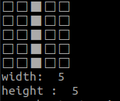

# Zone Counter Project

 
### Features

- Map creator GUI in python.
- Zone Counter program in c++
- Save Map as txt and use it from c++ and python.
- Create a map with MapInterface functions.
- C++ library for python wrapping

## Usage

### Test Evironment
- Ubuntu 18.04
- g++ v7.5.0
- C++ standard: 17
- Build tool: Cmake

### Run
Main code includes two examples:
1. Map from txt file created with python gui, then count of zone from this map
2. Creating map  with c++ api, then count of zone from this map.
If you want to provide another map text file created with python gui use: `./zonecounter --filepath <path>`

```bash
mkdir build
cd build
cmake ..
make -j4
cd ../bin
./zonecounter
```

### Custom Map
1. Use python gui for map creating
	- Save map as txt
	- Run zonecounter with filepath argument
2. C++ code
	- change codes inside `createMap` function in `main.cpp`
	
### ****NOTE**
For better understanding of algorithm that counts zones, usage of `SetSize` function adds edges to the map. 
For example, create a map inside `createMap` function in main.cpp:
```c++
map.SetSize(5,5);
map.SetBorder(3,1);
map.SetBorder(3,2);
map.SetBorder(3,3);
map.SetBorder(3,4);
map.SetBorder(3,5);
```
Result is:



`GetSize` function returns width and height with edges counts because of that. This situation is for debug and test purposes.


## Python GUI


Python GUI is developed for test purposes and also It provides map visuality, map creation speed, variety.

### Requirements for python
- Python3.6
- PyQt5

### Run
`python map_creator.py`


